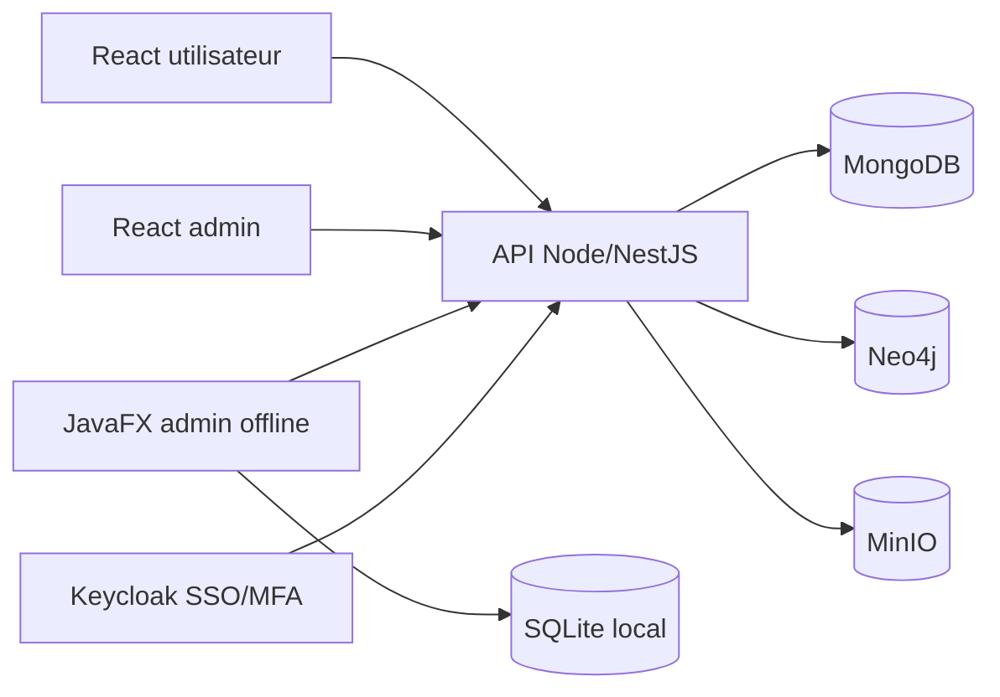
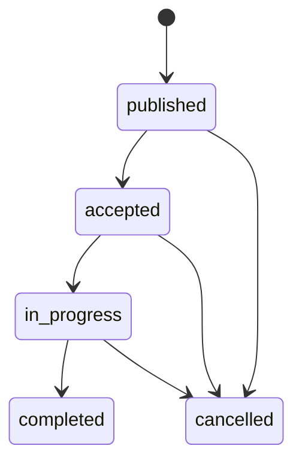
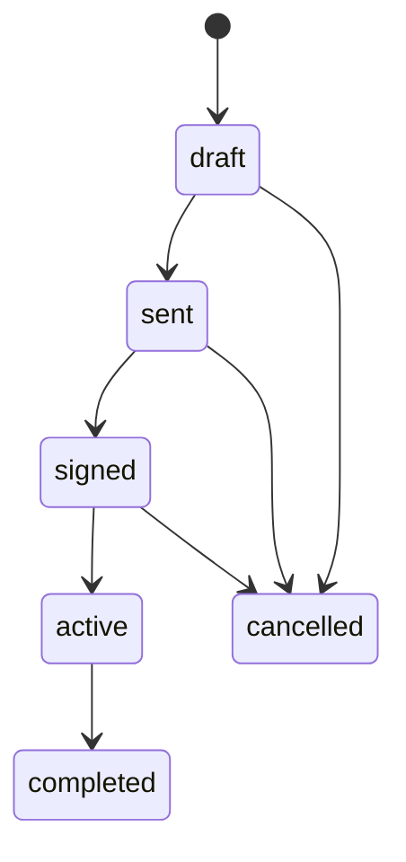

# Dossier technique — Étape 2

## 1. Rappel fonctionnel

Connected Neighbours est une plateforme collaborative de quartier. Elle permet aux habitants de publier des offres ou demandes de services, d'utiliser un système de points pour les services payants, de générer des contrats, de signer des documents PDF, de participer à des événements, d'échanger via messagerie et de voter sur des sujets de quartier.

L'administration est assurée par un back-office web et par une application JavaFX offline-first. Le client Java est dédié à la gestion des incidents, des alertes et des statistiques, avec une base locale embarquée et une synchronisation automatique au retour de connexion.

## 2. Architecture retenue

Le projet est organisé en monorepo :

- `apps/api` : API REST NestJS/Fastify, Swagger, MongoDB, authentification JWT locale pour la V1.
- `apps/web` : client React utilisateur.
- `apps/admin-web` : back-office React, encore à remplacer par une vraie interface métier.
- `docs` : livrables projet.
- `diagrams` : schémas d'architecture.

L'architecture cible reste modulaire :



## 3. Choix techniques

### Backend

Le backend utilise NestJS avec Fastify. Ce choix a été validé avec l'enseignant malgré la mention Express dans le sujet initial. Il permet de conserver Node.js côté serveur tout en bénéficiant d'une architecture modulaire, de Swagger intégré, de la validation DTO et d'un moteur HTTP performant.

Pour l'étape 2, l'API expose déjà :

- un endpoint racine et un endpoint health ;
- Swagger ;
- authentification locale de développement ;
- rôles `resident`, `moderator`, `admin` ;
- CRUD initial des services.

### Front web utilisateur

Le client utilisateur React permet :

- la connexion locale avec trois comptes de démonstration ;
- la conservation du token JWT ;
- la création d'une annonce de service ;
- la consultation des services publiés.

### Client lourd Java

La partie JavaFX est hors périmètre de ce lot de travail. Elle reste une exigence forte du sujet et sera traitée dans un lot dédié.

## 4. Modules fonctionnels

### Authentification et rôles

La V1 utilise une authentification locale JWT pour permettre la démonstration. La cible reste Keycloak OIDC avec MFA pour les actions sensibles.

Rôles :

- `resident` : accès aux services, événements, messagerie, votes ;
- `moderator` : modération et signalements ;
- `admin` : configuration quartier, incidents, statistiques et synchronisation JavaFX.

### Services entre voisins

Entité minimale :

- titre ;
- description ;
- type : offre ou demande ;
- catégorie ;
- disponibilité ;
- quartier ;
- propriétaire ;
- gratuit ou payant ;
- prix en points si payant ;
- statut.

Cycle de vie cible :



### Contrats et points

La règle métier cible est la suivante : un service payant ne peut pas être finalisé sans contrat signé. Les points sont réservés à l'acceptation puis transférés à la clôture.

État API étape 2 :

- acceptation d'un service gratuit sans contrat ;
- acceptation d'un service payant avec création de contrat ;
- réservation des points du payeur ;
- signature par les deux parties ;
- passage du service en cours après signature complète ;
- clôture du contrat avec transfert des points réservés.

États du contrat :



### Documents PDF

Le module cible devra gérer :

- import PDF ;
- placement de zones de signature et d'initiales ;
- signature sécurisée ;
- archivage du document final ;
- historique d'audit.

### JavaFX offline-first

Le client JavaFX doit fonctionner sans connexion. Les actions sont enregistrées localement puis synchronisées avec l'API.

## 5. Algorithmes complexes prévus

### Synchronisation offline-first

L'algorithme principal repose sur une outbox locale :

1. l'utilisateur crée ou modifie une donnée hors ligne ;
2. l'action est écrite dans SQLite ;
3. une opération idempotente est ajoutée à `sync_outbox` ;
4. au retour réseau, le client pousse les opérations non synchronisées ;
5. le client tire les changements serveur depuis `lastSyncAt` ;
6. les conflits V1 sont résolus par "dernière modification gagnante" avec journal d'audit.

### Recommandations Neo4j

La V1 utilisera un score simple basé sur :

- services réalisés entre deux habitants ;
- participations communes à des événements ;
- catégories d'intérêt ;
- avis positifs.

### Micro-langage MongoDB

Le micro-langage traduira des requêtes lisibles en filtres MongoDB. Exemple cible :

```text
services where category = "bricolage" and points <= 50
```

sera transformé en :

```json
{
  "collection": "services",
  "filter": {
    "category": "bricolage",
    "pricePoints": { "$lte": 50 }
  }
}
```

## 6. Sécurité et RGPD

Mesures prévues :

- OIDC/Keycloak pour le SSO ;
- MFA pour connexion, signature et modification d'identifiants ;
- rôles applicatifs ;
- export des données personnelles ;
- anonymisation ou suppression ;
- audit des signatures et synchronisations ;
- stockage des fichiers volumineux via MinIO avec URLs temporaires.

## 7. Conteneurisation

État actuel : `docker-compose.yml` démarre MongoDB.

État cible :

- API ;
- web utilisateur ;
- admin web ;
- MongoDB ;
- Neo4j ;
- Keycloak ;
- MinIO.

## 8. Risques identifiés

- Le choix NestJS/Fastify est validé par l'enseignant ; il doit simplement être rappelé clairement en soutenance.
- La partie JavaFX doit rapidement devenir exécutable sur un poste avec JDK 17.
- Les modules contrats/points/signature PDF sont critiques pour l'étape 3.
- Le back-office React est encore un template Vite.
- La conteneurisation est incomplète.
