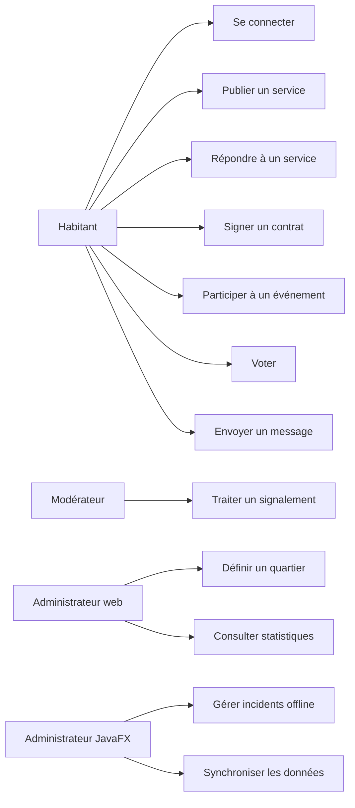

# Use cases — Étape 2

## Acteurs

- Habitant
- Modérateur
- Administrateur web
- Administrateur JavaFX
- Service d'authentification
- API Connected Neighbours

## Diagramme global

## UC-01 — Se connecter

**Acteur principal :** habitant, modérateur ou administrateur.

**Préconditions :**

- l'utilisateur dispose d'un compte actif ;
- l'API est disponible.

**Scénario nominal :**

1. L'utilisateur ouvre le client web.
2. Il saisit son identifiant et son mot de passe.
3. L'API vérifie les identifiants.
4. L'API retourne un token JWT.
5. Le client stocke le token et affiche l'espace utilisateur.

**Extensions :**

- identifiants invalides : message d'erreur ;
- compte inactif : accès refusé ;
- cible V2 : redirection Keycloak avec MFA.

## UC-02 — Publier une annonce de service

**Acteur principal :** habitant.

**Préconditions :**

- l'habitant est connecté ;
- il appartient à un quartier.

**Scénario nominal :**

1. L'habitant ouvre le formulaire de création.
2. Il saisit titre, description, type, catégorie, disponibilité et quartier.
3. Il choisit si le service est gratuit ou payé en points.
4. L'API crée l'annonce avec l'identifiant du propriétaire connecté.
5. L'annonce apparaît dans la liste des services.

**Règles métier :**

- un service payant doit avoir un nombre de points ;
- le propriétaire ne doit pas être fourni par le client mais par l'authentification ;
- le statut initial est `published`.

## UC-03 — Accepter un service payant

**Acteur principal :** habitant.

**Préconditions :**

- le service existe ;
- le service est payant ;
- le demandeur dispose d'assez de points.

**Scénario cible :**

1. Le demandeur répond à l'annonce.
2. Le propriétaire accepte.
3. L'API réserve les points.
4. L'API crée un contrat brouillon.
5. Les parties signent le contrat.
6. Le service passe en cours.

## UC-04 — Gérer un incident en JavaFX offline

**Acteur principal :** administrateur JavaFX.

**Préconditions :**

- le client JavaFX a déjà synchronisé des données ;
- la base SQLite locale est disponible.

**Scénario nominal offline :**

1. L'administrateur ouvre l'application JavaFX.
2. Il consulte les incidents déjà synchronisés.
3. Il crée un nouvel incident.
4. L'incident est écrit dans SQLite.
5. Une opération est ajoutée dans l'outbox.
6. L'interface indique qu'une synchronisation est en attente.

**Scénario de reconnexion :**

1. L'application détecte le retour réseau.
2. Elle pousse les opérations de l'outbox vers l'API.
3. Elle récupère les changements serveur depuis la dernière synchronisation.
4. Elle met à jour SQLite.
5. Elle marque les opérations comme synchronisées.

## UC-05 — Export RGPD

**Acteur principal :** habitant.

**Scénario cible :**

1. L'utilisateur demande un export de ses données.
2. L'API collecte profil, services, contrats, messages, votes et signatures.
3. L'API génère une archive exportable.
4. L'utilisateur télécharge ses données.
