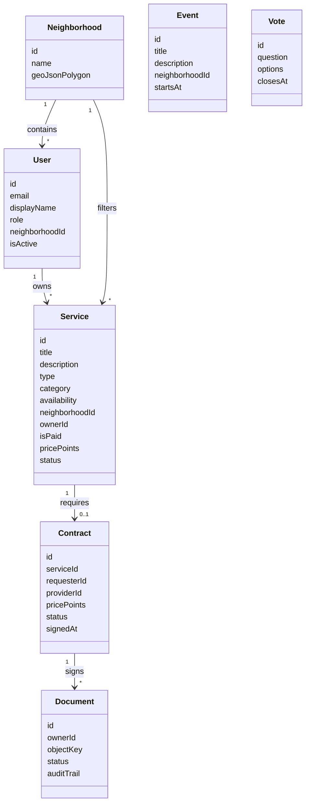
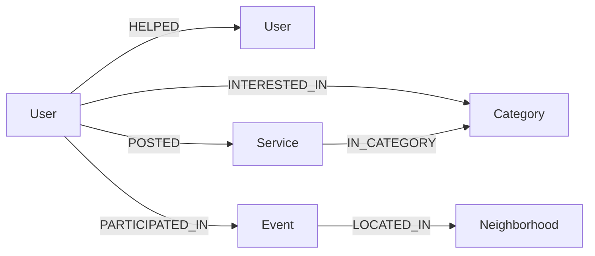

# Modélisation des données — Étape 2

## 1. Vue globale



## 2. MongoDB

MongoDB porte les documents métier principaux.

### `users`

```json
{
  "_id": "ObjectId",
  "email": "resident@connected.local",
  "displayName": "Resident Demo",
  "role": "resident",
  "neighborhoodId": "quartier-centre",
  "passwordHash": "...",
  "isActive": true,
  "createdAt": "Date",
  "updatedAt": "Date"
}
```

### `services`

```json
{
  "_id": "ObjectId",
  "title": "Babysitting samedi soir",
  "description": "Je propose 3 heures de babysitting.",
  "type": "offer",
  "category": "Entraide",
  "availability": "Samedi 19h-22h",
  "neighborhoodId": "quartier-centre",
  "ownerId": "ObjectId",
  "isPaid": true,
  "pricePoints": 50,
  "status": "published",
  "createdAt": "Date",
  "updatedAt": "Date"
}
```

### Collections prévues

- `neighborhoods`
- `contracts`
- `point_transactions`
- `documents`
- `document_signature_fields`
- `events`
- `event_participations`
- `messages`
- `votes`
- `vote_answers`
- `rgpd_requests`
- `sync_operations`

## 3. Neo4j

Neo4j sert au graphe social et aux recommandations.

### Noeuds

- `User`
- `Service`
- `Event`
- `Category`
- `Neighborhood`

### Relations



## 4. SQLite local JavaFX

La base locale du client JavaFX contient les incidents et la file d'attente de synchronisation.

```sql
CREATE TABLE incidents (
  id TEXT PRIMARY KEY,
  title TEXT NOT NULL,
  description TEXT NOT NULL,
  severity TEXT NOT NULL,
  status TEXT NOT NULL,
  created_at TEXT NOT NULL,
  updated_at TEXT NOT NULL,
  synced_at TEXT
);

CREATE TABLE sync_outbox (
  id TEXT PRIMARY KEY,
  aggregate_type TEXT NOT NULL,
  aggregate_id TEXT NOT NULL,
  operation_type TEXT NOT NULL,
  payload TEXT NOT NULL,
  created_at TEXT NOT NULL,
  synced_at TEXT,
  retry_count INTEGER NOT NULL DEFAULT 0,
  last_error TEXT
);

CREATE TABLE sync_state (
  key TEXT PRIMARY KEY,
  value TEXT NOT NULL
);
```

## 5. Index importants

- `users.email` unique ;
- `services.neighborhoodId + status` ;
- `services.ownerId` ;
- `contracts.serviceId` unique ;
- `messages.conversationId + createdAt` ;
- `sync_outbox.synced_at` côté SQLite.
