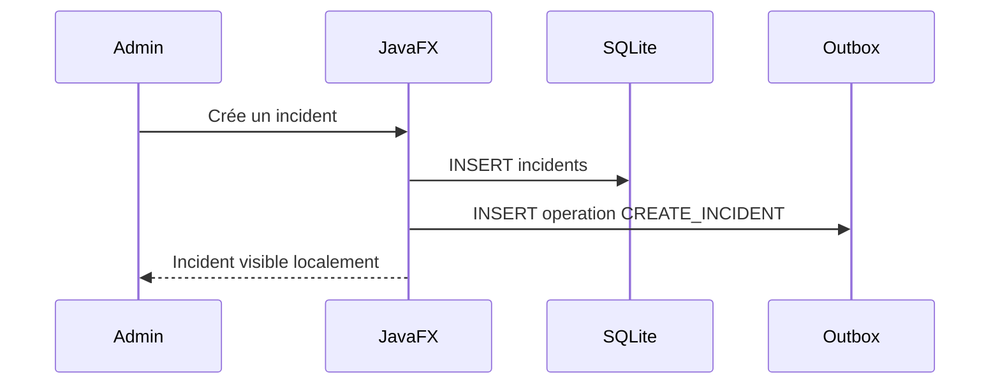
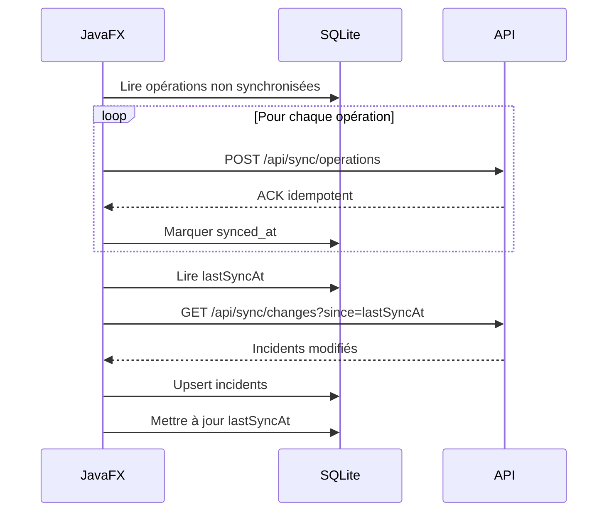

# Synchronisation JavaFX — Étape 2

## Objectif

L'application JavaFX doit rester utilisable sans internet. Les administrateurs peuvent consulter les incidents déjà synchronisés, créer de nouveaux incidents et préparer des changements. Dès qu'une connexion revient, l'application synchronise automatiquement les opérations locales avec l'API.

## Données locales

La base SQLite locale contient :

- `incidents` : état courant consultable offline ;
- `sync_outbox` : opérations locales à pousser ;
- `sync_state` : métadonnées comme `lastSyncAt`.

## Flux d'écriture offline



## Flux de reconnexion



## Idempotence

Chaque opération de l'outbox possède un identifiant unique généré côté JavaFX. L'API doit enregistrer les identifiants déjà traités pour éviter les doublons si le client renvoie une opération après une coupure.

## Gestion des conflits V1

Règle retenue pour l'étape 2 et V1 :

- chaque incident porte `updatedAt` ;
- si deux versions divergent, la version la plus récente gagne ;
- le conflit est journalisé dans l'audit serveur ;
- une résolution manuelle pourra être ajoutée en V2.

## Endpoints API à prévoir

```http
POST /api/sync/operations
GET /api/sync/changes?since=2026-04-27T10:00:00Z
GET /api/sync/state
```

## État actuel

Ce document décrit la stratégie à implémenter. Le code JavaFX n'est pas traité dans le lot API actuel.

La future démonstration JavaFX devra couvrir :

- modèle incident ;
- repository local SQLite ;
- table outbox ;
- service de synchronisation ;
- interface affichant les incidents et l'état de sync.
