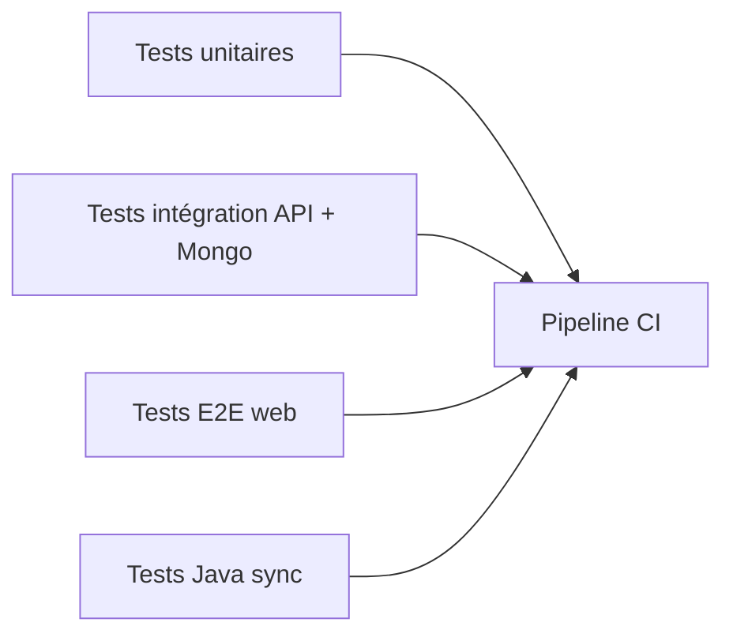

# Tests — Étape 2

## Objectif

Les tests doivent prouver que les premières règles métier sont sécurisées et que l'équipe sait les exécuter pendant la démonstration.

## Tests disponibles

### API

Les tests unitaires couvrent actuellement :

- endpoint racine et health check ;
- création de service avec statut par défaut ;
- listing des services triés par date ;
- consultation d'un service par id ;
- erreur `NotFoundException` si l'annonce n'existe pas ;
- suppression ;
- logique de remise à `null` des points quand un service devient gratuit ;
- passage de l'identifiant utilisateur authentifié du contrôleur vers le service.
- acceptation d'un service gratuit sans contrat ;
- création de contrat lors de l'acceptation d'un service payant ;
- réservation des points ;
- signature complète d'un contrat ;
- transfert des points réservés à la clôture ;
- erreurs métier sur solde insuffisant ou acceptation de son propre service.

Commande utilisée :

```powershell
cd apps/api
.\node_modules\.bin\jest.CMD --runInBand
```

Résultat actuel :

```text
Test Suites: 5 passed, 5 total
Tests: 18 passed, 18 total
```

## Qualité statique

Commandes API validées :

```powershell
cd apps/api
.\node_modules\.bin\eslint.CMD "src/**/*.ts"
.\node_modules\.bin\nest.CMD build
```

État actuel :

- lint API : OK ;
- build NestJS : OK.

## Tests à ajouter avant étape 3

- tests d'intégration API avec MongoDB de test ;
- tests e2e du parcours connexion + création service ;
- tests du futur module points/contrats ;
- tests de synchronisation JavaFX sur repository SQLite ;
- tests du parser de micro-langage MongoDB.

## Stratégie cible



## Risque actuel

Le test e2e Nest généré par défaut n'est pas encore adapté au démarrage Fastify/config réelle. Il doit être remplacé par un vrai scénario d'API avant l'étape 3.
