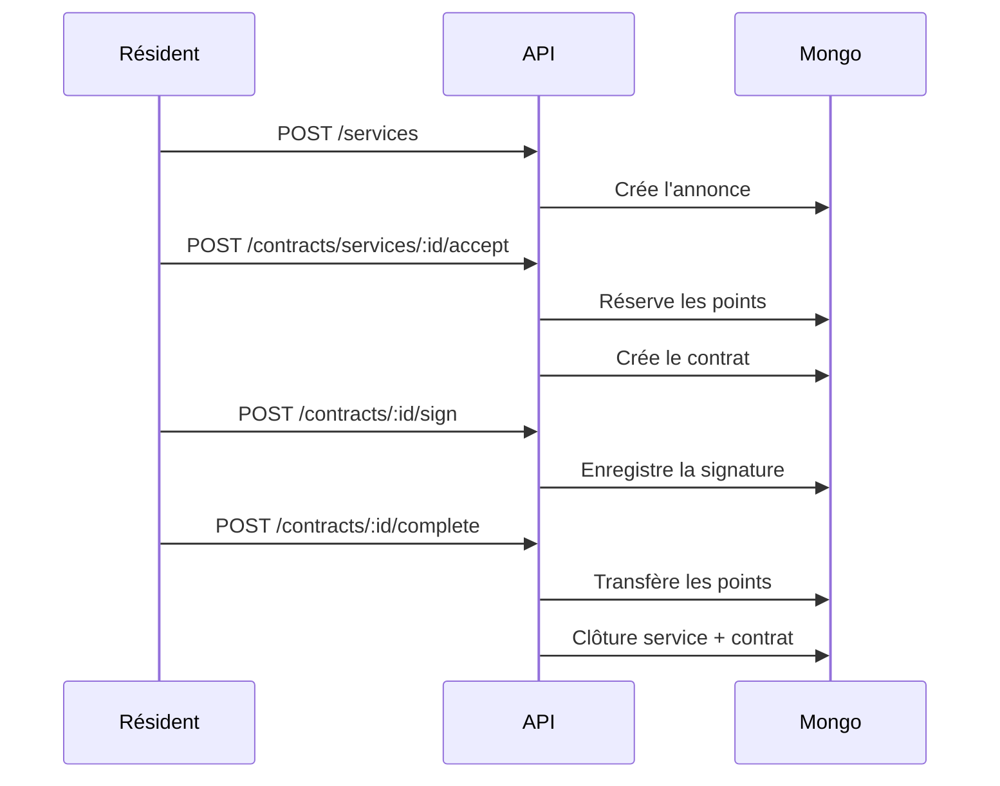

# API et Swagger — Étape 3

Swagger est disponible sur :

```text
http://localhost:3000/docs
```

## Modules API disponibles

| Module | Routes principales | État |
| --- | --- | --- |
| Auth | `/api/auth/login`, `/api/auth/me` | V1 démontrable |
| Services | `/api/services` | CRUD initial |
| Points | `/api/points/transactions` | Réservation, transfert, historique |
| Contrats | `/api/contracts` | Acceptation, signature, clôture |
| Quartiers | `/api/neighborhoods` | Création admin, GeoJSON, archivage |
| Événements | `/api/events` | Création, réponses, recommandations simples |
| Votes | `/api/votes` | Création, réponse, résultats, clôture |
| Documents | `/api/documents` | Référencement PDF, zones de signature, signature |
| Messagerie | `/api/messaging` | Conversations et messages texte REST |
| RGPD | `/api/rgpd/export` | Export des données personnelles V1 |

## Parcours métier principal



## Points techniques

- L'API est structurée en modules NestJS.
- Le moteur HTTP est Fastify, validé par l'enseignant.
- Les DTO sont validés par `class-validator`.
- Swagger est généré par `@nestjs/swagger`.
- Les données applicatives sont stockées dans MongoDB via Mongoose.
- Neo4j, Keycloak et MinIO restent dans l'architecture cible mais ne sont pas encore branchés en profondeur.
